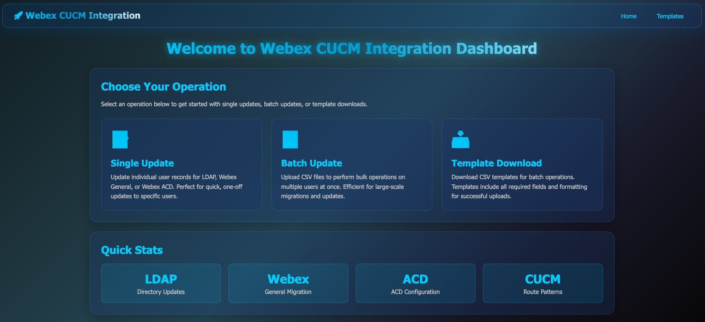
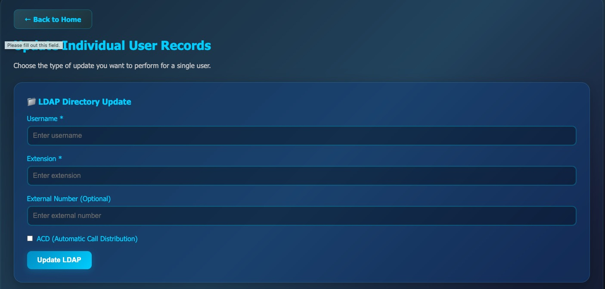
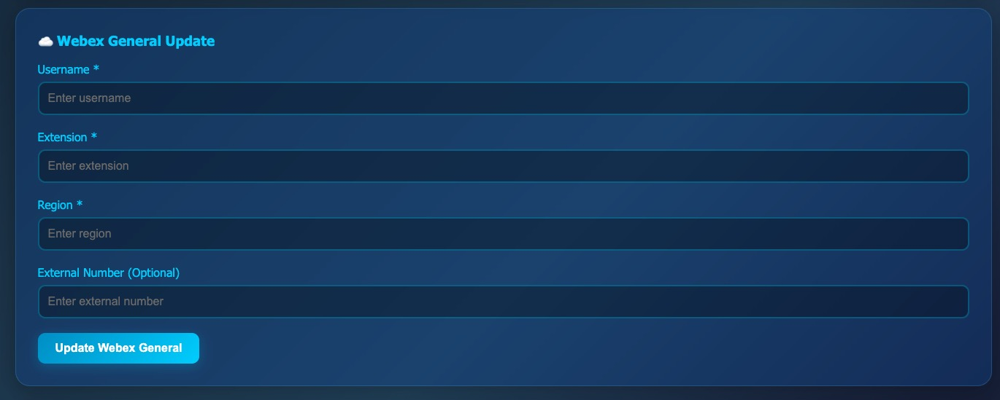
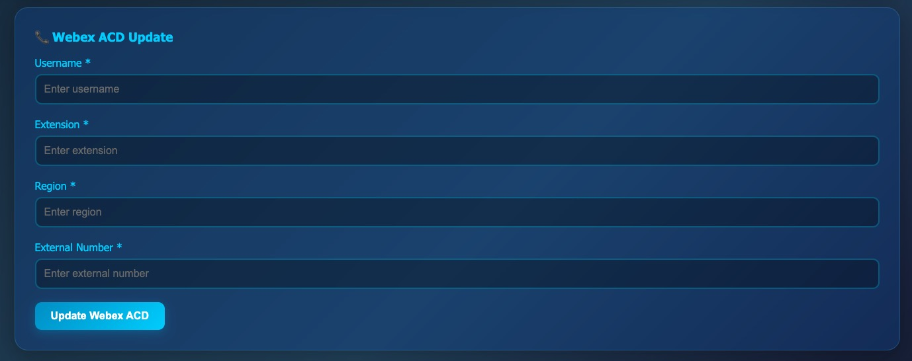
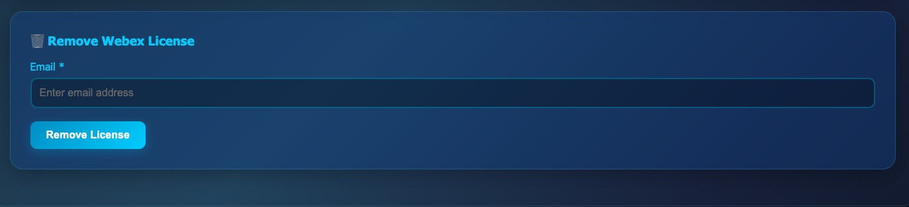
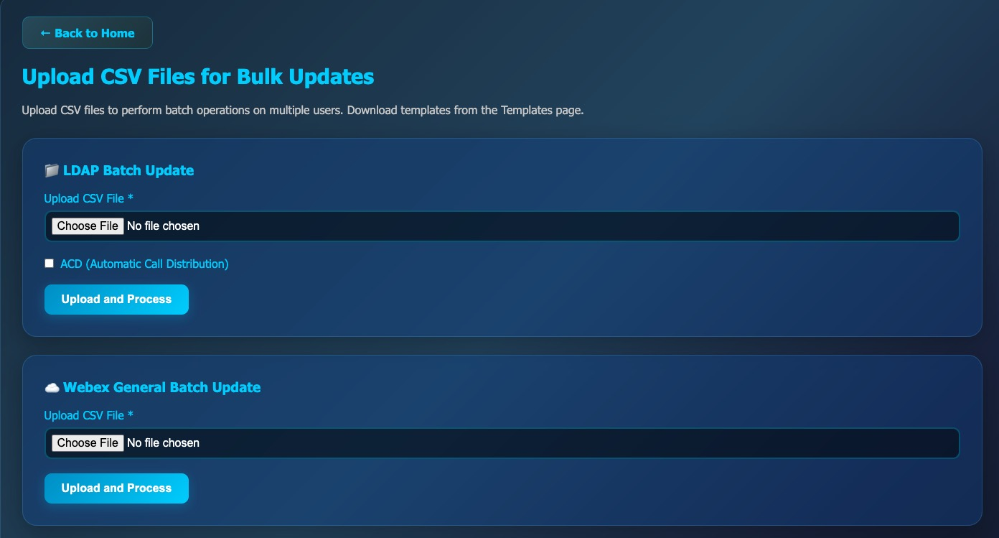
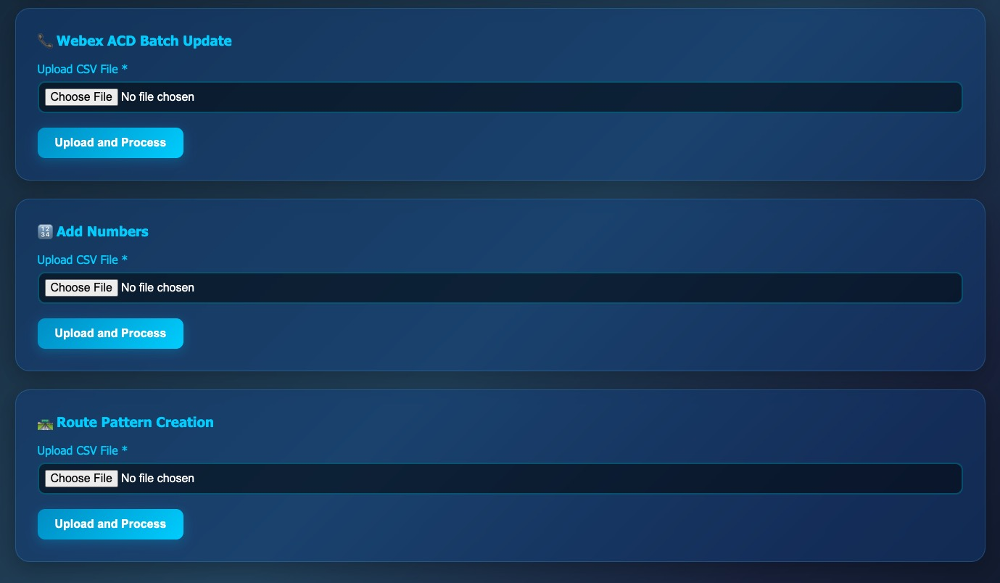
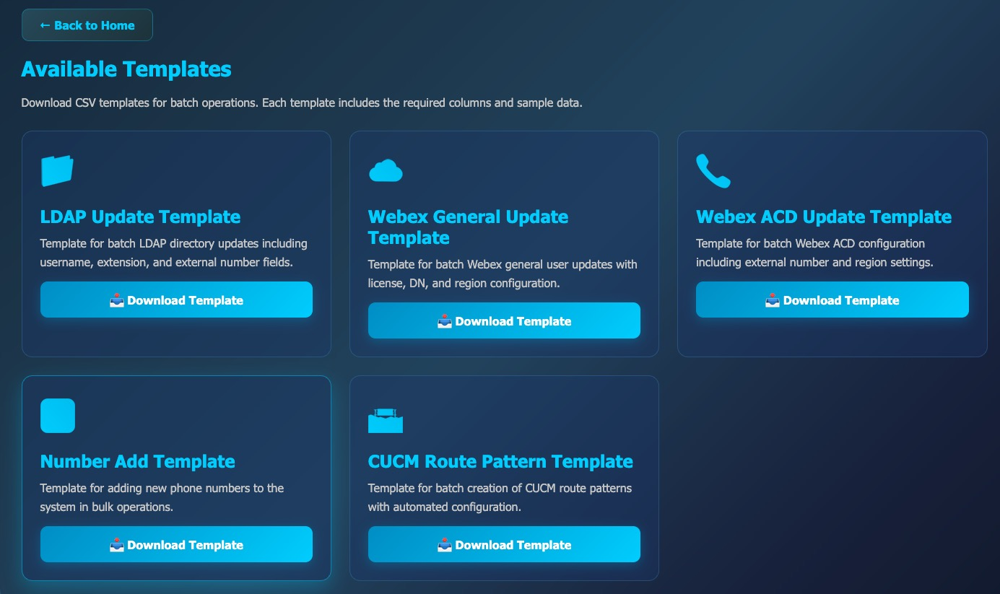

# Webex CUCM Integration

## Overview: 
This is a migration tool which aimed to streamline cloud migration with automation.

## Components:
### Runnable interface:

- Webpage, indicating various available features as:
    - Single user update: for single user
        - update ldap for single user by providing Username, Extension, External Number
            - Select ACD box for ACD agent update on Ldap
            
        - migrate single user to webex calling required information; Username, Extension, Region, External Number (optional for DID)
            
        - migrate single ACD user to webex calling with required information; Extension, Region, External Number
         **note: does the same thing as above, but external number is mandatory**
            
        - Add a number to any site on control hub
            
        - remove webex calling licenses and add UCM registration licensefor any user
            

    - Batch update: for list of users
        - batch update for all of the above features except remove license
            
            

    - Template download: sample csv files
        - Download templates which are to be used for batch update
            

# Technical Depth
### main components (backend engine):
- cucmapi: handles everything CUCM related
    - axlconn.py : Instantiates the connection between localhost and target(cucm)
    - axlop.py : Performs operations on device line.
    - axlroutepatternop.py: to update route pattern on cucm
- Webex API : Performs operations on webex control hub
    - License update and Extension update
    - ACD Agent migration
    - General Migration
    - Bulk phone number update on CH per region
- ldapapi: Performs LDAP Operation to update contact information in Contacts.akamai.com
    - Also generates user list with respective DID

### Supporting components:
- dict_helper.py : Cleans serialized zeep object retrieved from response of getxxxx() calls and converts them to native python dictionaries, and also helps clean unwanted keys from dictionary which cause errors which updating lines.
- logger.py : creates a logging pipeline to report events for each function calls and respection exceptions
- debugplugin.py : to be used if there is issue observed with zeep libraries, native from cisco repository.
- regioncreate.py : used to create local region reference for ACD migration, stores in metadata/acd_location.json

### Requirements:
- install requirements.txt
- CSV format:
    - refer templates
- create .env file which would contain:
    1. Username for CUCM
    2. Password
    3. URL of CUCM
    4. WebexAuth Token
    5. Ldap creds
- Sample of .env:
    - CUCM_ADDRESS="cucm-addresss"
    - AXL_USERNAME="username"
    - AXL_PASSWORD="password"
    - AUTHTOKEN="token"
    - LDAPUSER=akamai.com\svc_tmt_account
    - LDAPPASS="password"
    - LDAP_SERVER="wauth.corp.akamai.com:636"

### API interface:
- webexapp : bridges user interaction with the script and performs the required changes.

## Workflow:
- CUCM
    - Input user details along with target line number
    - axlop.py will fetch user phone (CSF, TCT and BOT) and its current lines,
    - if current lines have 555 at the begining, it will move to next line where it doesn't start with 555
    - validate if target line number is there already in CUCM or not
    - if not in cucm then create line with basic config (routepartition)
    - update line fetches rest of the line configuration and replaces the current line with target line with all current configuration for the user
    - main.py updates AD for contacts page updation
    - reports success

- Webex
    - Input user details along with target line number and Region
    - webexauto.py will do a get request to collect employee ID from webex (UUID from Webex)
    - Followed by a get request to retrieve current user configuration over webex
    - Removes the On-Prem registration license
    - Appends Webex Calling - Professional License
    - Updates Extension
    - main.py updates AD for contacts page updation
    - reports success
